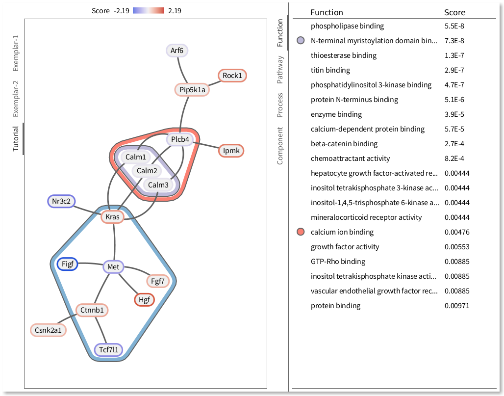

eXamine
=======
This stand-alone version of eXamine derives from the [Cytoscape app eXamine](https://github.com/ls-cwi/eXamine).
It supports a set-oriented visual analysis approach for annotated network modules.
These network modules are displayed as node-link diagrams with colored contours
on top to depict sets of nodes that share an annotation.



Compile
-------
- Requires (Open) JDK 1.7 or higher: https://openjdk.java.net/install

    Linux:
    ```
    sudo apt-get install default-jdk
    ```

    Mac:
    ```
    brew install openjdk
    ```

- Requires Apache Maven 3.8 or higher: https://maven.apache.org/download.cgi

    Linux:
    ```
    sudo apt-get install maven
    ```

    Mac:
    ```
    brew install maven
    ```

- Get eXamine from GitHub:
    ```
    git clone <HTTPS clone URL (see on the right side of this page)>
    ```

- Compile eXamine:
    ```
    cd eXamine-stand-alone
    mvn install
    ```

Run
---
The above compilation results in a `eXamine.jar` in the `eXamine-stand-alone` folder. Run it:
```
java -jar eXamine.jar
```

Datasets
--------
Datasets are placed in a folder `data-sets`, in the current working directory, and show up as tabs on the left side in eXamine.
Each data set has a folder that contains three types of files in tab-separated format:
- `*.nodes` lists the nodes of the network, with a unique `Identifier`, a `Symbol` that is displayed on the node, one or multiple scores that are visualized as the node's contour with a divergent colormap, and a `URL` that links to more information when the node is clicked. See [Exemplar-1/proteins.nodes](data-sets/Exemplar-1/proteins.nodes) for an example.
- `*.links` lists the undirected node-to-node links, as pairs of node identifiers, that form the network. See [Exemplar-1/interactions.links](data-sets/Exemplar-1/interactions.links) for an example.
- `*.annotations` lists the annotations, or sets of nodes, that cover parts of this network. Each annotation has a unique `Identifier`, a `Symbol` that is displayed in the annotation lists on the right side in eXamine, a `Category` that organizes the annotations into tabs on the right side in eXamine, a single `Score` that is displayed alongside the annotation, and a `URL` that links to more information if available. See [Exemplar-1/go_and_kegg.annotations](data-sets/Exemplar-1/go_and_kegg.annotations) for an example.
- `*.memberships` lists which nodes are covered by which annotations, as module-to-node pairs of identifiers. See [Exemplar-1/go_and_kegg.memberships](data-sets/Exemplar-1/modules.annotations) for an example.

The `Module` Category of annotations should always be present, as you can see in [Exemplar-1/modules.annotations](data-sets/Exemplar-1/modules.annotations). Any node displayed by eXamine is present in at least one of these modules. eXamine will not show any node if there are no `Module` annotations.

You can partition the files of a dataset. For example, the links of your network can be split across multiple `*.link` files. However, the identifiers of nodes and annotations have to be unique within the entire dataset, these are not scoped by file.
